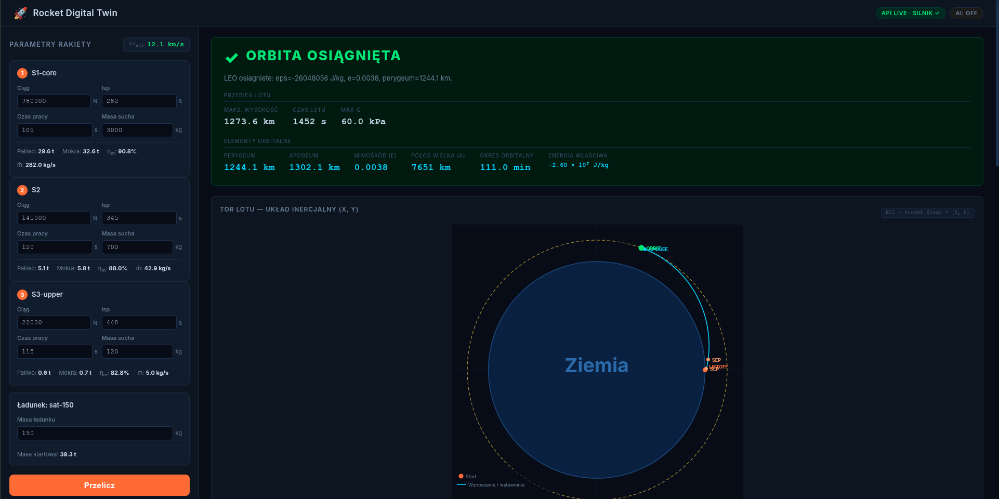

# Rocket Digital Twin

[](https://www.python.org/)
[](https://github.com/pyenv/pyenv)
[](https://github.com/astral-sh/uv)
[](https://nodejs.org/)
[](https://react.dev/)
[](https://www.typescriptlang.org/)
[](https://fastapi.tiangolo.com/)
[](https://numpy.org/)
[](https://scipy.org/)
[](https://docs.pydantic.dev/)

> A digital twin of a launch vehicle delivering a satellite to low Earth orbit (LEO).
> Change a parameter -> recompute -> see the mission impact.

**SpatiumCavum Team** - Space Shield 2026 Hackathon

---



## Motivation

Designing a launch vehicle is a game of trade-offs: stage mass, engine thrust, number
of stages - every decision changes the mission success probability. Traditionally,
answering the question *"what happens if I change this stage?"* requires building and
testing.

This project answers that question **digitally, in real time**. It simulates a full
satellite launch mission and lets you safely experiment with any rocket parameter,
instantly showing whether the satellite reaches a stable orbit.

## Description

Rocket Digital Twin implements the **Digital Twin loop**:

```
parameter change  ->  mission simulation  ->  verdict + trajectory  ->  (repeat)
```

The system consists of a physics engine (full orbital mechanics), an API (HTTP), and a
browser-based interface (visualization). It places the rocket into orbit using a
realistic maneuver profile (gravity turn + Hohmann transfer), and determines mission
success based on **Keplerian elements** (energy, eccentricity, perigee) - not an
instantaneous altitude value.

**What the system shows:** orbital verdict with numbers (perigee, apogee, eccentricity,
period), mission timeline (launch, separations, orbit insertion), telemetry over time
(velocity, altitude, g-load, dynamic pressure), and trajectory/orbit visualization
around Earth.

## System Requirements (Debian)

Before proceeding to **Quick start**, install the system dependencies below.

**1. System tools (APT):**

```bash
sudo apt update
sudo apt install -y curl ca-certificates git build-essential
```

**2. Python 3.13 via pyenv (recommended on Debian):**

Install dependencies required to build Python:

```bash
sudo apt install -y make libssl-dev zlib1g-dev libbz2-dev libreadline-dev \
  libsqlite3-dev libffi-dev liblzma-dev tk-dev xz-utils wget llvm
```

Install pyenv:

```bash
curl https://pyenv.run | bash
```

Add pyenv to your shell configuration (bash):

```bash
echo 'export PYENV_ROOT="$HOME/.pyenv"' >> ~/.bashrc
echo '[[ -d $PYENV_ROOT/bin ]] && export PATH="$PYENV_ROOT/bin:$PATH"' >> ~/.bashrc
echo 'eval "$(pyenv init - bash)"' >> ~/.bashrc
exec "$SHELL"
```

Install Python 3.13 and set it locally for this repository:

```bash
pyenv install 3.13.7
pyenv local 3.13.7
python --version
```

After running pyenv local, a .python-version file will appear in the repository
directory, ensuring all uv commands use the correct local Python version.

**3. uv package manager (backend):**

```bash
curl -LsSf https://astral.sh/uv/install.sh | sh
```

After installation, make sure uv is available in PATH:

```bash
uv --version
```

**4. Node.js 18+ and npm (frontend):**

```bash
sudo apt install -y nodejs npm
node --version
npm --version
```

> On Debian stable, the nodejs package may be older than 18. If so, install Node.js
> 18+ from the official NodeSource repository, or use the nvm manager.

After meeting these requirements, proceed to **Quick start**.

## Quick start

Requirements: **Python 3.13** + [uv](https://github.com/astral-sh/uv), **Node.js 18+** + npm.

**1. Backend** (API + physics engine) - from the repository root:

```bash
uv sync                                      # install dependencies (one-time)
uv run uvicorn dt_api.app:app --port 8000   # start API on :8000
```

**2. Frontend** (UI, English mode) - in a separate terminal:

```bash
cd frontend
npm install        # install dependencies (one-time)
npm run dev:en     # start on :5173 with English UI
```

**3. Open** [http://localhost:5173](http://localhost:5173). The
**API LIVE · ENGINE ✓** indicator in the top-right corner confirms the full chain is
running. Click **Recompute** to run the golden preset simulation.

> Interactive API docs (Swagger): [http://localhost:8000/docs](http://localhost:8000/docs)

## Presentation and submission documentation

The [presentation/](presentation/) directory contains submission materials:

| File | Description |
|------|------|
| [Rocket_Digital_Twin__SpatiumCavum_team.pptx](presentation/Rocket_Digital_Twin__SpatiumCavum_team.pptx) | Presentation (slides, editable) |
| [Rocket_Digital_Twin__SpatiumCavum_team.pdf](presentation/Rocket_Digital_Twin__SpatiumCavum_team.pdf) | Presentation (PDF) |
| [dokumentacja.pdf](presentation/dokumentacja.pdf) | Full technical documentation: setup, UI description, physics foundations (formulas), architecture |

## Repository map

```
.
|-- packages/              # backend (monorepo, uv workspace)
|   |-- contracts/         # dt_contracts - data schemas (Pydantic), single source of truth
|   |-- physics-engine/    # dt_physics - physics engine (NumPy/SciPy)
|   |-- api/               # dt_api - HTTP API (FastAPI)
|   `-- ai/                # dt_ai - optimization (optional)
|-- frontend/              # interface (React + Vite + TypeScript)
|   `-- src/components/    # visualizations: trajectory, orbit, telemetry, verdict
|-- docs/                  # documentation (see below)
|-- presentation/          # submission materials (slides, PDF documentation)
`-- golden_preset.json     # example rocket reaching orbit
```

## Documentation guide (docs/)

| Document | Content |
|----------|-----------|
| [docs/SYSTEM_OVERVIEW.md](docs/SYSTEM_OVERVIEW.md) | System operation overview: what it is, how it is built, what it shows |
| [docs/PHYSICS_MODEL.md](docs/PHYSICS_MODEL.md) | Physical foundations: model, Keplerian verdict, sources (MIT, SMAD) |
| [docs/DESIGN_DECISIONS.md](docs/DESIGN_DECISIONS.md) | Rationale behind key design choices |
| [docs/PRESENTATION_OUTLINE.md](docs/PRESENTATION_OUTLINE.md) | Presentation outline and demo scenario |
| [docs/architecture/](docs/architecture/) | Architecture decisions, physics theory base, communication |
| [docs/goal/PROGRESS.md](docs/goal/PROGRESS.md) | Project compass: goals, status, milestone log |
| [docs/decisions/](docs/decisions/) | Architecture Decision Records (ADR) |

## Author

**Mateusz Bala** - **SpatiumCavum** team.
Repository: [github.com/MateuszBala/Spaceshield_Hack_2026_PTR_DLD_Digital_Twin_Mission](https://github.com/MateuszBala/Spaceshield_Hack_2026_PTR_DLD_Digital_Twin_Mission)

## License

This project is released under the **MIT** license - free use, modification, and
distribution with attribution preserved. Full text is available in the [LICENSE](LICENSE) file.
