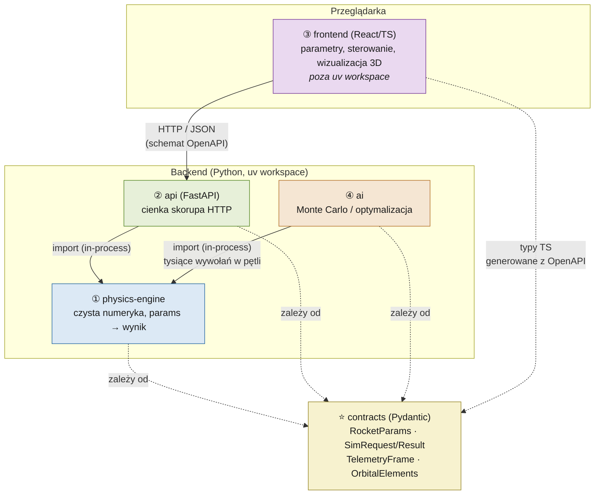
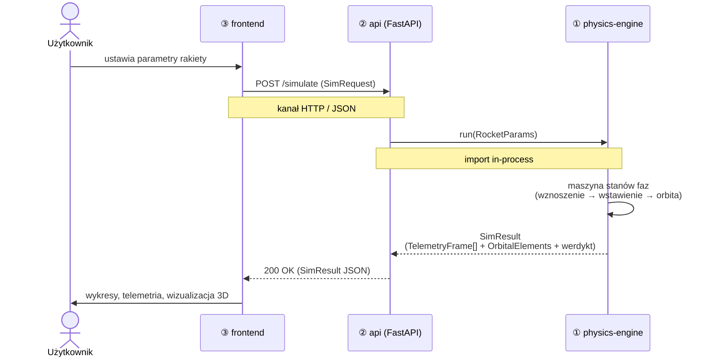
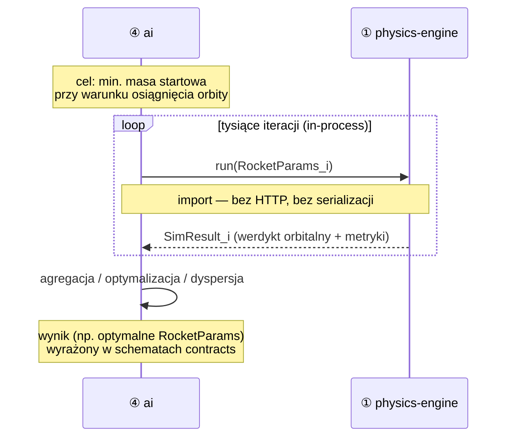

# Komunikacja między pakietami

Dokument obrazuje, jak komunikują się ze sobą cztery pakiety projektu oraz warstwa
wspólna `contracts`. Rozróżniamy dwie warstwy:

- **Kanał `import` (in-process)** — wywołanie funkcji w tym samym procesie Pythona,
  bez serializacji i sieci. Używany tam, gdzie liczy się przepustowość (AI → silnik).
- **Kanał `HTTP`** — granica procesu/sieci między przeglądarką a backendem. Używany
  tylko między frontendem a API.

`contracts` jest zależnością wszystkich pakietów, ale w runtime jest "niewidzialny":
to definicja *kształtu* danych płynących po strzałkach, nie osobny serwis.

---

## 1. Zależności + kanały komunikacji

Legenda:
- linia ciągła `→` = kanał komunikacji w runtime (HTTP lub import),
- linia przerywana `-.->` = zależność od warstwy wspólnej `contracts`.

Kluczowe granice:
- **frontend nie importuje Pythona** — gada z API wyłącznie po HTTP; typy TypeScript
  generuje z OpenAPI (które FastAPI produkuje z modeli `contracts`).
- **physics-engine nie wie o istnieniu API ani frontu** — jest czystą biblioteką.
- **AI woła silnik importem**, nie przez HTTP — bo robi tysiące przebiegów w pętli i
  narzut sieciowy byłby nieakceptowalny.

---

## 2. Przepływ danych: pojedyncza symulacja z frontu

---

## 3. Przepływ danych: optymalizacja / Monte Carlo (AI)

Wynik pracy AI (zoptymalizowane parametry, statystyki dyspersji) jest wyrażony w tych
samych schematach `contracts`, więc może zostać podany dalej do API/frontu bez
tłumaczenia formatów.

---

## 4. Mapowanie na worktree i granice zapisu

| Pakiet | Instancja / worktree | Pisze w | Komunikuje się przez |
|--------|----------------------|---------|----------------------|
| ① physics-engine | `feat/engine` | `packages/physics-engine/` | wywoływany importem przez ② i ④ |
| ② api | `feat/api` | `packages/api/` | HTTP ↔ ③ ; import → ① |
| ③ frontend | `feat/frontend` | `packages/frontend/` | HTTP → ② |
| ④ ai | `feat/ai` | `packages/ai/` | import → ① |
| ⭐ contracts | — (read-only) | nikt samodzielnie | zależność wszystkich |

`contracts` jest jedynym współdzielonym punktem — dlatego pozostaje read-only dla
instancji i musi być zaprojektowany jako pierwszy. Każda zmiana kontraktu to zmiana
styku wielu pakietów, więc zgłaszana, nie wprowadzana samodzielnie.
